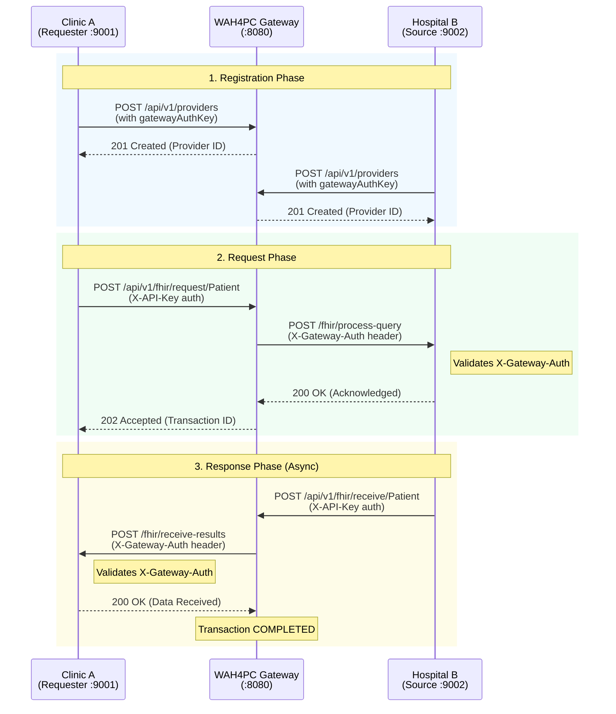

# WAH4PC Gateway

A healthcare interoperability gateway that facilitates secure FHIR (Fast Healthcare Interoperability Resources) data exchange between healthcare providers. The gateway acts as a central routing hub, enabling clinics, hospitals, and other healthcare facilities to request and share patient data through standardized APIs.

## Table of Contents

- [Overview](#overview)
- [Architecture](#architecture)
- [Quick Start](#quick-start)
- [Configuration](#configuration)
- [API Reference](#api-reference)
- [Simulation and Testing](#simulation-and-testing)
- [Project Structure](#project-structure)

---

## Overview

The WAH4PC Gateway provides:

- Secure routing of FHIR resource requests between healthcare providers
- Provider registration and management
- API key-based authentication with role-based access
- Transaction tracking and audit logging
- Rate limiting per API key

### How It Works

1. A **Requester** (e.g., a clinic) sends a patient data request through the gateway
2. The gateway forwards the query to the **Source** provider (e.g., a hospital)
3. The source processes the request and sends the data back to the gateway
4. The gateway delivers the result to the original requester

---

## Architecture



**Authentication Layers:**

| Layer | Header | Purpose |
|-------|--------|---------|
| Client to Gateway | `X-API-Key` | Authenticates the calling provider to the Gateway |
| Gateway to Provider | `X-Gateway-Auth` | Authenticates the Gateway to the receiving provider |

**Data Flow Summary:**

1. Clinic A requests patient data from Hospital B via the gateway (authenticated with API key)
2. Gateway forwards the query to Hospital B with `X-Gateway-Auth` header for verification
3. Hospital B validates the gateway's identity, processes, and sends data back
4. Gateway delivers the result to Clinic A (also with `X-Gateway-Auth` for verification)

---

## Quick Start

### Prerequisites

- Go 1.22 or higher
- MongoDB (local instance on `localhost:27017`, or Docker)

### Installation

```bash
# Clone the repository
git clone https://github.com/wah4pc/wah4pc-gateway.git
cd wah4pc-gateway

# Download dependencies
go mod download
```

### Running the Gateway

```bash
go run cmd/main.go
```

### Running with Docker Compose

```bash
docker compose up -d
```

The server starts on `http://localhost:8080` by default.

**Expected Output:**

```
Starting wah4pc-gateway v1.0.0
Server listening on 0.0.0.0:8080
Gateway Base URL: http://localhost:8080
API Authentication: Enabled (use X-API-Key header)
Master Key: Configured (use X-Master-Key header for admin access)
```

---

## Configuration

The gateway is configured via `config.yaml`:

```yaml
app:
  name: "wah4pc-gateway"
  version: "1.0.0"

server:
  host: "0.0.0.0"
  port: 8080
  base_url: "http://localhost:8080"  # Used for callback URLs

security:
  master_key: "tcgtrio123"  # Admin access key

mongodb:
  uri: "mongodb://localhost:27017"
  database: "wah4pc_gateway"
  providers_collection: "providers"
  transactions_collection: "transactions"
  api_keys_collection: "api_keys"
  settings_collection: "settings"

logging:
  level: "info"  # debug, info, warn, error
```

### Configuration Options

| Section | Field | Description |
|---------|-------|-------------|
| `server.host` | Host address | Network interface to bind (0.0.0.0 for all) |
| `server.port` | Port number | HTTP server port |
| `server.base_url` | Base URL | Gateway's public URL for callbacks |
| `security.master_key` | Master key | Administrative access key |
| `mongodb.uri` | MongoDB URI | Connection string for MongoDB |
| `mongodb.database` | Database | MongoDB database name |
| `mongodb.*_collection` | Collection names | Collection names for each domain model |

### Environment Variables

Override the config file path:

```bash
CONFIG_PATH=/path/to/config.yaml go run cmd/main.go
```

---

## API Reference

### Authentication

All API endpoints (except `/health`) require authentication via HTTP headers:

| Header | Purpose | Usage |
|--------|---------|-------|
| `X-API-Key` | Standard access | Required for all authenticated endpoints |
| `X-Master-Key` | Admin access | Bypasses API key requirement, grants full access |

**Default Master Key:** `tcgtrio123` (change in production)

---

### Endpoints

#### Health Check

| Method | Endpoint | Auth | Description |
|--------|----------|------|-------------|
| GET | `/health` | No | Returns gateway health status |

**Response:**
```json
{
  "status": "healthy",
  "service": "wah4pc-gateway"
}
```

---

#### Providers

Manage healthcare provider registrations.

| Method | Endpoint | Description |
|--------|----------|-------------|
| GET | `/api/v1/providers` | List all providers |
| POST | `/api/v1/providers` | Register a new provider |
| GET | `/api/v1/providers/{id}` | Get provider by ID |
| PUT | `/api/v1/providers/{id}` | Update provider |
| DELETE | `/api/v1/providers/{id}` | Delete provider |
| POST | `/api/v1/providers/{id}/status` | Set provider active/inactive |
| GET | `/api/v1/providers/facilities/{facilityCode}/practitioners` | List practitioners for a facility (provider proxy) |

**Register Provider:**

```bash
curl -X POST http://localhost:8080/api/v1/providers \
  -H "Content-Type: application/json" \
  -H "X-API-Key: your-api-key" \
  -d '{
    "name": "City Hospital",
    "type": "hospital",
    "baseUrl": "http://localhost:9002"
  }'
```

**Get Practitioners by Facility:**

```bash
curl -X GET http://localhost:8080/api/v1/providers/facilities/HOSP-001/practitioners \
  -H "X-API-Key: your-api-key"
```

**Response:**
```json
{
  "success": true,
  "data": [
    {
      "id": "prac-123",
      "reference": "Practitioner/prac-123",
      "display": "Dr. Juan Dela Cruz",
      "identifiers": [
        {
          "system": "http://prc.gov.ph/license",
          "value": "PRC-001"
        }
      ]
    }
  ]
}
```

---

#### FHIR Operations

Request and receive FHIR resources between providers.

| Method | Endpoint | Description |
|--------|----------|-------------|
| POST | `/api/v1/fhir/request/{resourceType}` | Initiate a FHIR resource request |
| POST | `/api/v1/fhir/receive/{resourceType}` | Receive FHIR data (callback endpoint) |

**Request Patient Data:**

```bash
curl -X POST http://localhost:8080/api/v1/fhir/request/Patient \
  -H "Content-Type: application/json" \
  -H "X-API-Key: your-api-key" \
  -d '{
    "requesterId": "provider-id-1",
    "targetId": "provider-id-2",
    "identifiers": [
      {
        "system": "http://hospital.example.com/mrn",
        "value": "pat-123"
      }
    ],
    "reason": "Patient referral",
    "notes": "Requesting patient record for treatment"
  }'
```

**Response:**
```json
{
  "success": true,
  "data": {
    "id": "tx-abc123",
    "status": "PENDING",
    "message": "Request forwarded to target provider"
  }
}
```

---

#### Transactions

Monitor and track data exchange transactions.

| Method | Endpoint | Description |
|--------|----------|-------------|
| GET | `/api/v1/transactions` | List all transactions |
| GET | `/api/v1/transactions/{id}` | Get transaction by ID |

**Get Transaction Status:**

```bash
curl http://localhost:8080/api/v1/transactions/tx-abc123 \
  -H "X-API-Key: your-api-key"
```

---

#### API Keys

Manage API keys for authentication.

| Method | Endpoint | Description |
|--------|----------|-------------|
| GET | `/api/v1/apikeys` | List all API keys |
| POST | `/api/v1/apikeys` | Create new API key |
| GET | `/api/v1/apikeys/{id}` | Get API key by ID |
| DELETE | `/api/v1/apikeys/{id}` | Delete API key |
| POST | `/api/v1/apikeys/{id}/revoke` | Revoke API key |

**Create API Key:**

```bash
curl -X POST http://localhost:8080/api/v1/apikeys \
  -H "Content-Type: application/json" \
  -H "X-Master-Key: tcgtrio123" \
  -d '{
    "owner": "Integration Service",
    "role": "admin",
    "rateLimit": 1000
  }'
```

**Response:**
```json
{
  "success": true,
  "data": {
    "id": "key-abc123",
    "key": "wah_xxxxxxxxxxxxxxxxxxxx",
    "prefix": "wah_xxxx",
    "owner": "Integration Service",
    "role": "admin"
  }
}
```

---

## Simulation and Testing

The project includes a simulation script that demonstrates the complete data exchange workflow between two mock healthcare providers.

### Running the Simulation

**Step 1:** Start the gateway in one terminal:

```bash
go run cmd/main.go
```

**Step 2:** Run the simulation script in another terminal:

```bash
go run scripts/mock_providers.go
```

### What the Simulation Does

The simulation script (`scripts/mock_providers.go`) performs the following automated steps:

1. **Bootstrap Authentication**
   - Creates an API key using the master key
   - All subsequent requests use this API key

2. **Start Mock Providers**
   - **Clinic A (Requester)** starts on `http://localhost:9001`
     - Endpoint: `/fhir/receive-results` - Receives patient data from the gateway
     - Validates `X-Gateway-Auth` header on incoming requests
   - **Hospital B (Source)** starts on `http://localhost:9002`
     - Endpoint: `/fhir/process-query` - Processes incoming queries
     - Validates `X-Gateway-Auth` header on incoming requests

3. **Register Providers**
   - Registers Clinic A with the gateway as a "clinic" type
   - Registers Hospital B with the gateway as a "hospital" type
   - Both registrations include a `gatewayAuthKey` for secure Gateway-to-Provider communication

4. **Execute FHIR Transfer**
   - Clinic A requests patient data (ID: `pat-123`) from Hospital B
   - Gateway routes the request to Hospital B with `X-Gateway-Auth` header
   - Hospital B validates the header, processes, and responds with mock patient data
   - Gateway delivers the data to Clinic A with `X-Gateway-Auth` header
   - Clinic A validates the header and accepts the data

5. **Verify Transaction**
   - Checks the transaction status to confirm successful completion

### Expected Simulation Output

```
[Clinic A] Starting server on :9001...
[Hospital B] Starting server on :9002...

========================================
Mock Providers Started!
========================================
Clinic A (Requester): http://localhost:9001
Hospital B (Source):  http://localhost:9002
========================================

--- Starting Simulation ---

[Simulation] Step 1: Creating API Key...
[Auth] Creating API key using master key...
[Auth] API key created successfully!

[Simulation] Step 2: Registering Clinic A...
[Simulation] Clinic A registered with ID: prov-xxxxx

[Simulation] Step 3: Registering Hospital B...
[Simulation] Hospital B registered with ID: prov-xxxxx

[Simulation] Step 4: Initiating FHIR Patient transfer...
[Simulation] From: Hospital B -> To: Clinic A

[Hospital B] Received query from Gateway!
[Hospital B] Query details:
  Transaction ID: tx-xxxxx
  Requester: prov-xxxxx
  Identifiers: 1 identifier(s)
  Return URL: http://localhost:8080/api/v1/fhir/receive/Patient

[Hospital B] Sending patient data to Gateway...
[Hospital B] Data sent successfully!

[Clinic A] Received data from Gateway!
[Clinic A] Data received:
{
  "resourceType": "Patient",
  "id": "pat-123",
  "name": [{"family": "Dela Cruz", "given": ["Juan", "Santos"]}],
  ...
}

[Simulation] Step 5: Checking transaction status...
[Simulation] Transaction status:
{
  "success": true,
  "data": {
    "id": "tx-xxxxx",
    "status": "COMPLETED"
  }
}

--- Simulation Complete ---
Mock providers will continue running. Press Ctrl+C to stop.
```

### Simulation Configuration

The simulation uses the following constants (defined in `scripts/mock_providers.go`):

| Constant | Value | Description |
|----------|-------|-------------|
| `gatewayURL` | `http://localhost:8080` | Gateway address |
| `clinicAPort` | `:9001` | Clinic A server port |
| `hospitalBPort` | `:9002` | Hospital B server port |
| `masterKey` | `tcgtrio123` | Master key for initial setup |
| `gatewayAuthKey` | `sim-gateway-auth-secret-123` | Secret for Gateway-to-Provider auth |

### Customizing the Simulation

To modify the mock patient data, edit the `mockPatientData` variable in `scripts/mock_providers.go`. The default mock patient:

```go
var mockPatientData = map[string]interface{}{
    "resourceType": "Patient",
    "id":           "pat-123",
    "name": []map[string]interface{}{
        {
            "family": "Dela Cruz",
            "given":  []string{"Juan", "Santos"},
        },
    },
    "gender":    "male",
    "birthDate": "1990-05-15",
    // ... additional fields
}
```

---

## Project Structure

```
wah4pc-gateway/
|-- cmd/
|   +-- main.go                 # Application entry point
|
|-- internal/
|   |-- config/                 # Configuration loading
|   |-- handler/                # HTTP request handlers
|   |-- middleware/             # Auth, rate limiting
|   |-- model/                  # Data models
|   |-- repository/             # Data persistence
|   |-- router/                 # Route definitions
|   +-- service/                # Business logic
|
|-- scripts/
|   +-- mock_providers.go       # Simulation script
|
|-- dashboard/                  # Admin dashboard (Next.js)
|-- frontend-docs/              # Documentation site (Next.js)
|
|-- config.yaml                 # Gateway configuration
|-- go.mod                      # Go module definition
+-- go.sum                      # Dependency checksums
```

---

## License

This project is proprietary software. All rights reserved.


