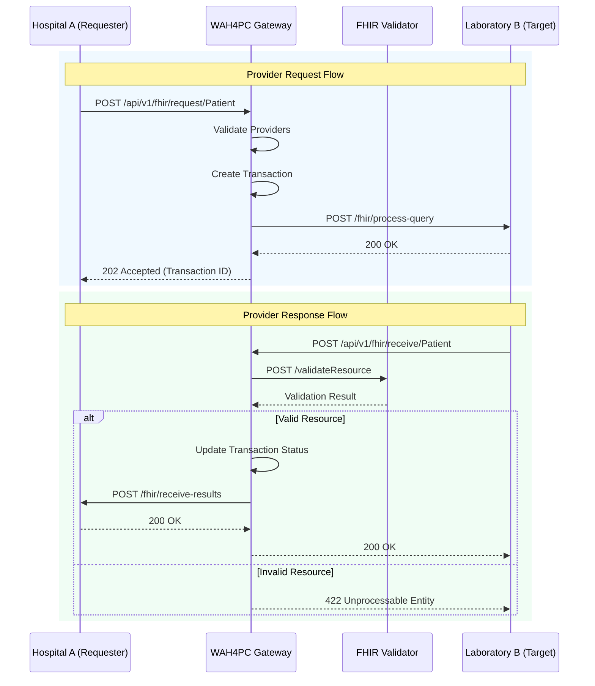
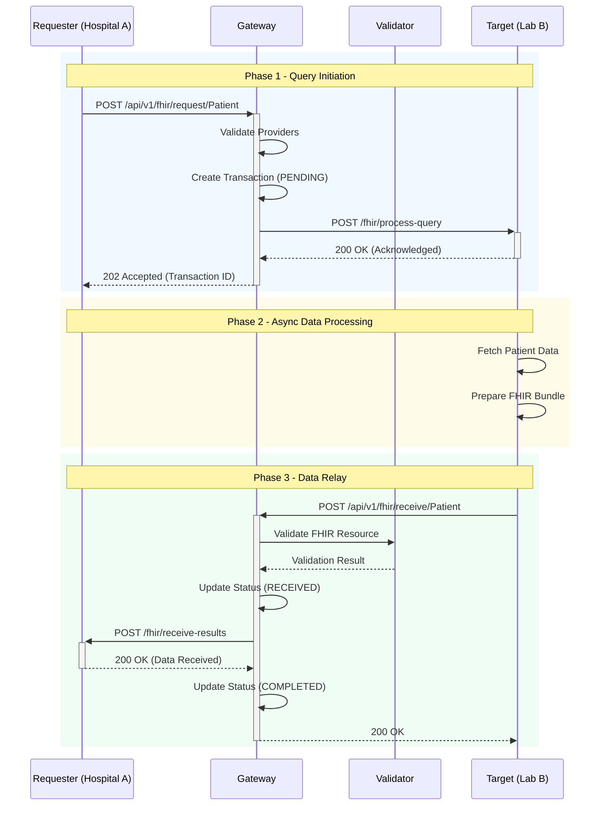
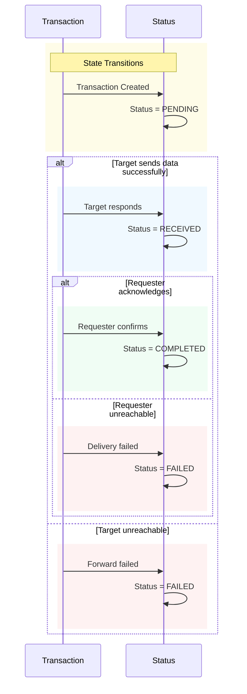

# System Architecture

Understanding the data flow and transaction lifecycle of the WAH4PC Gateway.

## System Components

The diagram below shows how healthcare providers interact with the gateway
and how requests flow through the system.

### Component Interaction Model


## Transaction Flow

The gateway uses an asynchronous request/response model. When a provider
requests data, the gateway orchestrates the entire flow without blocking.

### Async Request/Response Cycle


> **Key Points**

## Transaction States

Each transaction progresses through a state machine. This enables status
tracking and prevents duplicate processing.

### State Machine Diagram


• PENDING: Request sent to target, awaiting response
• RECEIVED: Target sent data, relaying to requester
• COMPLETED: Requester acknowledged receipt
• FAILED: Provider unreachable or error occurred

## Data Models

### {dataModels.provider.title}

**Provider Struct**
```json
{
"id": "uuid",
"name": "City Hospital",
"type": "hospital",
"baseUrl": "https://api.cityhospital.com",
"createdAt": "2024-01-15T10:00:00Z",
"updatedAt": "2024-01-15T10:00:00Z"
}
```

### {dataModels.transaction.title}

**Transaction Struct**
```json
{
"id": "uuid",
"requesterId": "provider-uuid",
"targetId": "provider-uuid",
"patientId": "patient-123",
"resourceType": "Patient",
"status": "PENDING",
"metadata": {
"reason": "Referral",
"notes": "Urgent"
},
"createdAt": "...",
"updatedAt": "..."
}
```