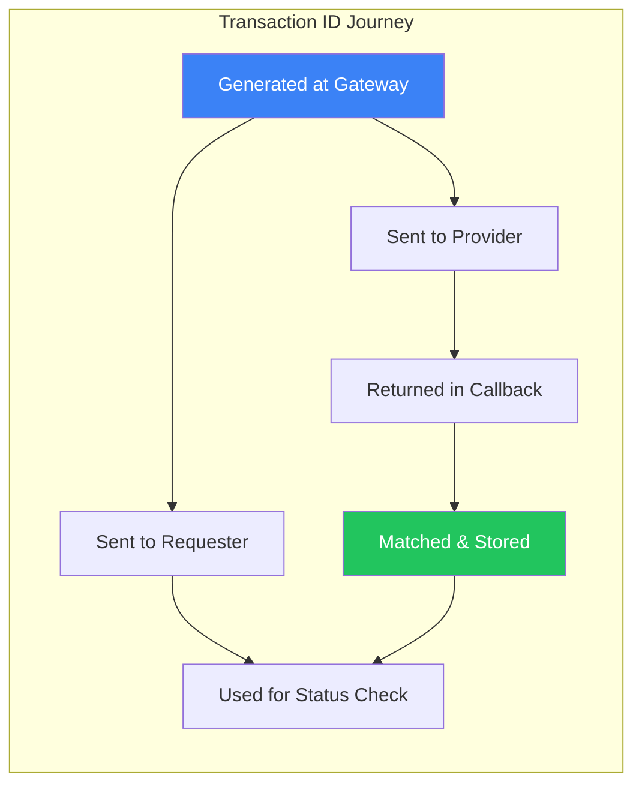
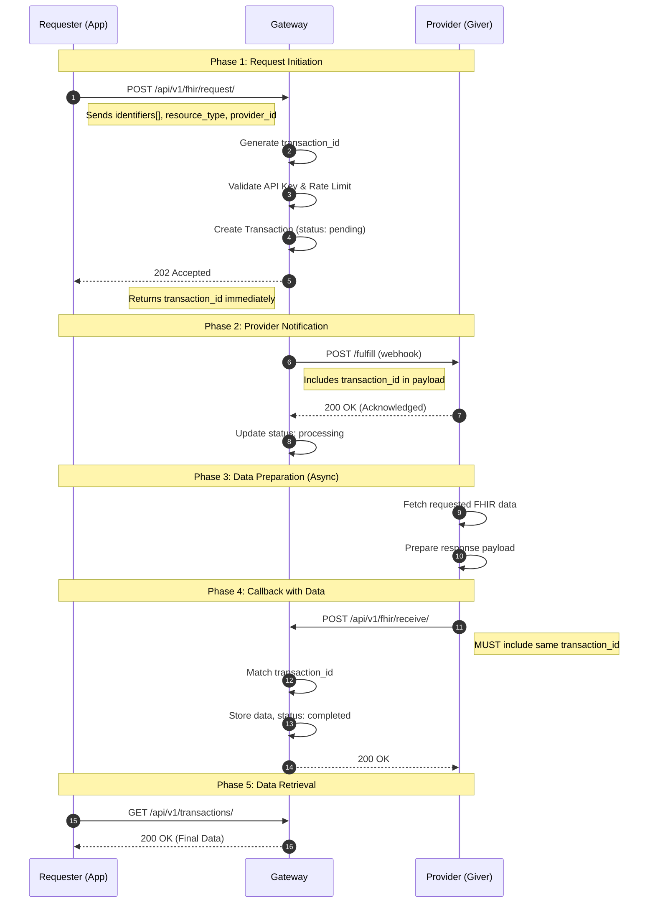
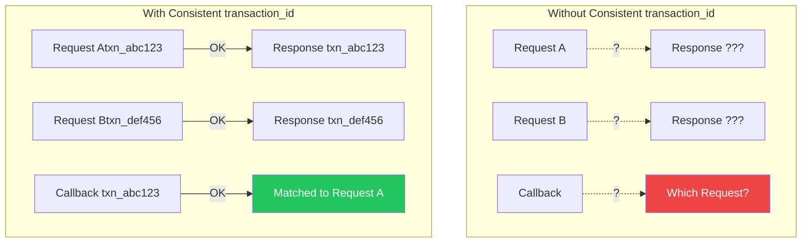

# Understanding the Transaction Flow

A detailed walkthrough of how requests move through the Gateway, and why the transaction_id is the critical link between all systems.

## Introduction

The WAH4PC Gateway uses an **asynchronous request/response model**.
When a healthcare provider requests patient data from another provider, the Gateway
orchestrates the entire flow without blocking. At the heart of this process is the{" "}
`
transaction_id
`
—a unique identifier that links every step from initial request to final delivery.

> **Why This Matters**
Understanding the transaction flow is essential for both **Requesters** (those
asking for data) and **Providers/Givers** (those supplying data). Each party
must handle the `transaction_id` correctly for the system to work.

**Looking for the big picture?** This page covers the *micro-level* details
of individual requests. For the *macro-level* provider lifecycle (registration, discovery,
monitoring), see the{" "}

System Flow Overview

.

##
The Transaction ID: Your Golden Thread

The `
transaction_id` is a UUID v4 prefixed with `txn_`.
It's generated by the Gateway the moment a request is received and follows the data
through every stage of processing.

Example ID

`
txn_a1b2c3d4-e5f6-7890-abcd-ef1234567890
`

### Why It Matters

{benefitIcons[benefit.icon]}

#### {benefit.title}

{benefit.description}

### The ID's Journey

### ID Propagation Flow

##
Complete Transaction Lifecycle

The diagram below shows the complete flow from when a Requester initiates a data
request to when they receive the final response. Notice how the{" "}
`transaction_id` appears at every critical juncture.

### Sequence Diagram

> **Key Observation**
The Gateway **never blocks**. After returning the `transaction_id` to
the Requester (Step 6), it immediately proceeds to notify the Provider. The Requester
polls later using that same ID.

##
Step-by-Step with JSON Examples

Let's walk through each step with actual request/response payloads. Pay attention
to how the `transaction_id` propagates.

**Request Body**

The `targetId` identifies WHO has the data.
The `patientId` specifies WHICH patient.

**Response Body**

**202 Accepted** means "I've received your request and will process it."
It does NOT mean "here's your data." The Requester must poll the `status_url` later.

**Webhook Payload to Provider**

**Provider: You MUST save this transaction_id!** When you send data back,
you'll need to include it. Without it, the Gateway cannot match your response to the original request.

**Callback Payload from Provider**

The `transaction_id` in this payload is how the Gateway knows
which request this data fulfills. It's the correlation key.

`

Full circle! The same transaction_id` from Step 2
is used to retrieve the final result. The journey is complete.

##
Consistency Rules: The Non-Negotiables

For the system to work reliably, everyone must follow these rules:

### Data Consistency Model

#### {item.rule}

{item.description}

##
Common Error Scenarios

Understanding what can go wrong helps you implement correctly. Here are common errors
related to `transaction_id` handling:

#### {scenario.scenario}

Request

Response

{scenario.explanation}

##
Detailed Step Reference

A comprehensive breakdown of each step in the transaction lifecycle:

{step.step}

#### {step.title}

{step.actor}

{step.endpoint !== "N/A" && step.endpoint !== "Internal" && (

{step.endpoint}

)}

{step.description}

{step.keyPoint}

## Summary

{[
"The transaction_id is generated by the Gateway and returned immediately.",
"Both Requesters and Providers must use this ID in all related operations.",
"Providers MUST include the ID in callbacks—without it, the data cannot be matched.",
"The ID enables async processing, audit trails, and idempotency.",
"Treat the transaction_id as immutable—never modify, always preserve."
].map((text, i) => (

))}