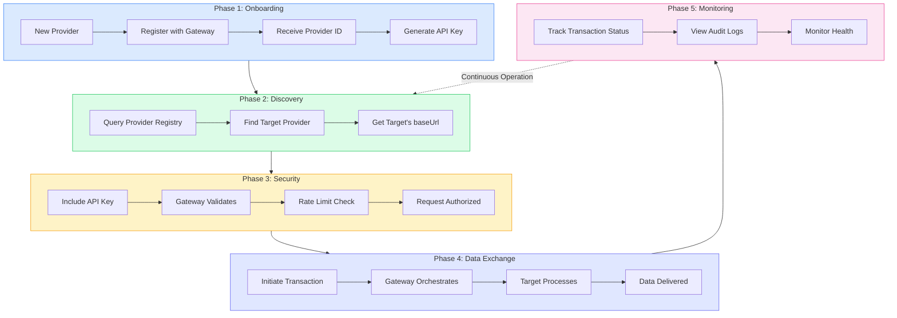

# System Flow Overview

Understand the complete lifecycle of participating in the WAH4PC Gateway—from initial registration to ongoing monitoring. This is the 

## Introduction

The WAH4PC Gateway enables healthcare providers to exchange FHIR data securely.
Before diving into individual API calls, it's important to understand the{" "}
**overall system flow**—the lifecycle every provider goes through
to participate in the network.

> **System Flow vs. Transaction Flow**
**System Flow** (this page) describes the *macro-level* lifecycle:
how you join the network, discover other providers, and maintain ongoing participation.

**Transaction Flow** (see{" "}

Transaction Flow

) describes the *micro-level* detail: what happens when you send a single
data request through the gateway.

## The Provider Lifecycle

Every provider goes through five phases. After initial onboarding, you continuously
cycle through discovery, authentication, exchange, and monitoring.

### Lifecycle Overview

## Phase-by-Phase Breakdown

{lifecyclePhases.map((phase) => {
const colors = phaseColors[phase.color];
return (

{phaseIcons[phase.icon]}

Phase {phase.phase}

### {phase.title}

{phase.subtitle}

{phase.description}

#### What Happens

Key Insight

{phase.keyInsight}

);
})}

## System Flow vs. Transaction Flow

Understanding the difference between these two concepts is crucial for proper integration:

Aspect
System Flow
Transaction Flow

{row.aspect}
{row.systemFlow}
{row.transactionFlow}

## Key Concepts

### {concept.term}

{concept.definition}

`
{concept.example}
`

## Quick Start Path

Follow these steps to go from zero to your first data exchange:

{item.step}

{item.action}
`
{item.endpoint}
`

{item.result}

{idx < quickStartSteps.length - 1 && (

)}

## Ready to dive deeper?

###
Provider Integration →

Step-by-step guide to implement the webhook endpoints your system needs.

###
Transaction Flow →

Deep dive into how individual requests move through the gateway.